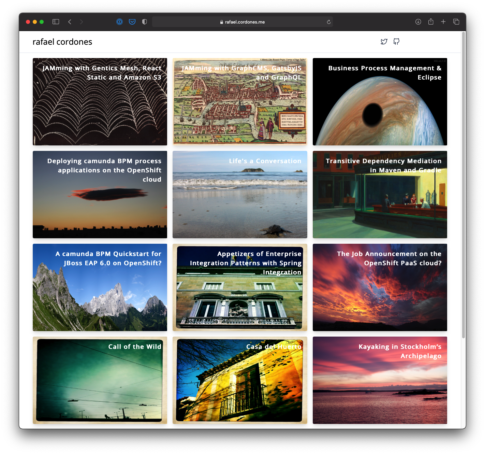

Personal website implemented with [Nuxt.js Content Module](https://content.nuxtjs.org/).



## Build Setup

```bash
# install dependencies
$ yarn

# serve with hot reload at localhost:3000
$ yarn dev

# build for production
$ yarn build

# generate static project
$ yarn generate
```

## Credits
1. [Debbie O'Brien's](https://debbie.codes/) [Nuxt Content module](https://content.nuxtjs.org/) [demo project](https://github.com/nuxt-company/demo-blog-nuxt-content). See also [Create a Blog with Nuxt Content](https://nuxtjs.org/blog/creating-blog-with-nuxt-content/).
1. Solution for using images in Markdown content by [Muhammad Muhaddis](http://muhaddis.info/) via [Resolve assets in markdown content #106](https://github.com/nuxt/content/issues/106#issuecomment-663873586)
